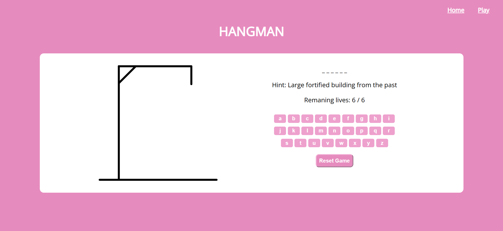

# 🔤 Hangman Game

## 🕹️ Description

This is a classic Hangman game built using HTML, CSS, and JavaScript.  
The player guesses letters to uncover a hidden word. Each wrong guess brings the hangman closer to being fully drawn.  
The game ends when the player either completes the word or runs out of lives!

## 🚀 Getting Started

👉 **Play it here:** [https://sara-jaffar.github.io/hangman-game/](https://sara-jaffar.github.io/hangman-game/)

👉 **Planning Materials:**
- [Trello Board](https://trello.com/b/ep0FJCGW/project1)

### How to Play
1. Open the game link.
2. Press "Start Game" to begin.
3. Click on letters to guess the word.
4. You win if you guess all the letters before running out of lives.

## 💡 Technologies Used

- HTML
- CSS
- JavaScript

## 🚧 Next Steps

- Add sound effects  
- Add animations for correct and wrong guesses  
- Make it responsive for mobile  
- Add difficulty levels or categories  